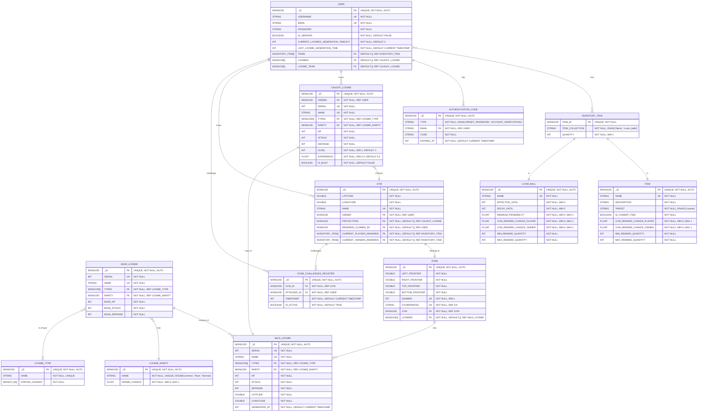

# Entity Relationship Diagram

```mermaid
erDiagram
    USER }o--o{ INVENTORY_ITEM: Has
    INVENTORY_ITEM ||--|| ITEM: Is
    INVENTORY_ITEM ||--|| LOOM_BALL: Is
    USER ||--o{ AUTHENTICATION_CODE: Has
    BASE_LOOMIE ||--o{ WILD_LOOMIE: "Instance of"
    BASE_LOOMIE }o--|| LOOMIE_RARITY: Has
    BASE_LOOMIE }o--|{ LOOMIE_TYPE: "Is of type"
    WILD_LOOMIE ||--|| CAUGHT_LOOMIE: "Copy of"
    USER ||--o{ CAUGHT_LOOMIE: Owns
    USER ||--o{ GYM: Owns
    CAUGHT_LOOMIE }|--||  GYM: Protects
    GYM ||--|| ZONE: "Belongs to"
    ZONE ||--o{ WILD_LOOMIE: Has
    USER ||--o{ GYMS_CHALLENGES_REGISTER: Challenge
    GYM ||--o{ GYMS_CHALLENGES_REGISTER: Challenged

    USER {
        MONGOID _ID PK "UNIQUE, NOT NULL, AUTO"
        STRING USERNAME UK "NOT NULL"
        STRING EMAIL UK "NOT  NULL"
        STRING PASSWORD "NOT NULL"
        BOOLEAN IS_VERIFIED "NOT NULL, DEFAULT FALSE"
        INT CURRENT_LOOMIES_GENERATION_TIMEOUT "NOT NULL, DEFAULT 0"
        INT LAST_LOOMIE_GENERATION_TIME "NOT NULL, DEFAULT CURRENT TIMESTAMP"
        INVENTORY_ITEM[] ITEMS FK "DEFAULT [], REF INVENTORY_ITEM"
        MONGOID[] LOOMIES FK "DEFAULT [], REF CAUGHT_LOOMIE"
        MONGOID[] LOOMIE_TEAM FK "DEFAULT [], REF CAUGHT_LOOMIE"
    }

    INVENTORY_ITEM{
        MONGOID ITEM_ID PK "UNIQUE, NOT NULL"
        STRING ITEM_COLLECTION "NOT NULL, ENUM ['Items', 'Loom_balls']"
        INT QUANTITY "NOT NULL, MIN 1"
    }

    ITEM {
        MONGOID _ID PK "UNIQUE, NOT NULL, AUTO"
        STRING NAME UK "NOT NULL"
        STRING DESCRIPTION "NOT NULL"
        STRING TARGET "NOT NULL, ENUM ['Loomie']"
        BOOLEAN IS_COMBAT_ITEM "NOT NULL"
        FLOAT GYM_REWARD_CHANCE_PLAYER "NOT NULL, MIN 0, MAX 1"
        FLOAT GYM_REWARD_CHANCE_OWNER "NOT NULL, MIN 0, MAX 1"
        INT MIN_REWARD_QUANTITY "NOT NULL"
        INT MAX_REWARD_QUANTITY "NOT NULL"
    }


    LOOM_BALL {
        MONGOID _ID PK "UNIQUE, NOT NULL, AUTO"
        STRING NAME UK "NOT NULL"
        INT EFFECTIVE_UNTIL "NOT NULL, MIN 0"
        INT DECAY_UNTIL "NOT NULL, MIN 0"
        FLOAT MINIMUM_PROBABILITY "NOT NULL, MIN 0, MAX 1"
        FLOAT GYM_REWARD_CHANCE_PLAYER "NOT NULL, MIN 0, MAX 1"
        FLOAT GYM_REWARD_CHANCE_OWNER "NOT NULL, MIN 0, MAX 1"
        INT MIN_REWARD_QUANTITY "NOT NULL"
        INT MAX_REWARD_QUANTITY "NOT NULL"
    }

    AUTHENTICATION_CODE {
        MONGOID _ID PK "UNIQUE, NOT NULL, AUTO"
        STRING TYPE "NOT NULL, ENUM ['RESET_PASSWORD', 'ACCOUNT_VERIFICATION']"
        STRING EMAIL FK "NOT NULL, REF USER"
        STRING CODE "NOT NULL"
        INT EXPIRES_AT "NOT NULL, DEFAULT CURRENT TIMESTAMP"
    }

    LOOMIE_RARITY {
        MONGOID _ID PK "UNIQUE, NOT NULL, AUTO"
        STRING NAME "NOT NULL, UNIQUE, ENUM['Common', 'Rare', 'Normal']"
        FLOAT SPAWN_CHANCE "NOT NULL, MIN 0, MAX 1"
    }

    LOOMIE_TYPE {
        MONGOID _ID PK "UNIQUE, NOT NULL, AUTO"
        STRING NAME "NOT NULL, UNIQUE"
        MONGO_ID[] STRONG_AGAINST "NOT NULL"
    }

    BASE_LOOMIE {
        MONGOID _ID PK "UNIQUE, NOT NULL, AUTO"
        INT SERIAL UK "NOT NULL"
        STRING NAME UK "NOT NULL"
        MONGOID[] TYPES FK "NOT NULL, REF LOOMIE_TYPE"
        MONGOID RARITY FK "NOT NULL, REF LOOMIE_RARITY"
        INT BASE_HP "NOT NULL"
        INT BASE_ATTACK "NOT NULL"
        INT BASE_DEFENSE "NOT NULL"
    }

    WILD_LOOMIE {
        MONGOID _ID PK "UNIQUE, NOT NULL, AUTO"
        INT SERIAL UK "NOT NULL"
        STRING NAME UK "NOT NULL"
        MONGOID[] TYPES FK "NOT NULL, REF LOOMIE_TYPE"
        MONGOID RARITY FK "NOT NULL, REF LOOMIE_RARITY"
        INT HP "NOT NULL"
        INT ATTACK "NOT NULL"
        INT DEFENSE "NOT NULL"
        DOUBLE LATITUDE "NOT NULL"
        DOUBLE LONGITUDE "NOT NULL"
        INT GENERATED_AT "NOT NULL, DEFAULT CURRENT TIMESTAMP"
    }

    CAUGHT_LOOMIE {
        MONGOID _ID PK "UNIQUE, NOT NULL, AUTO"
        MONGOID OWNER FK "NOT NULL, REF USER"
        INT SERIAL UK "NOT NULL"
        STRING NAME UK "NOT NULL"
        MONGOID[] TYPES FK "NOT NULL, REF LOOMIE_TYPE"
        MONGOID RARITY FK "NOT NULL, REF LOOMIE_RARITY"
        INT HP "NOT NULL"
        INT ATTACK "NOT NULL"
        INT DEFENSE "NOT NULL"
        INT LEVEL "NOT NULL, MIN 1, DEFAULT 1"
        FLOAT EXPERIENCE "NOT NULL, MIN 0.0, DEFAULT 0.0"
        BOOLEAN IS_BUSY "NOT NULL, DEFAULT FALSE"
    }

    GYM {
        MONGOID _ID PK "UNIQUE, NOT NULL, AUTO"
        DOUBLE LATITUDE "NOT NULL"
        DOUBLE LONGITUDE "NOT NULL"
        STRING NAME UK "NOT NULL"
        MONGOID OWNER FK "NOT NULL, REF USER"
        MONOGID PROTECTORS FK "NOT NULL, DEFAULT [], REF CAUGHT_LOOMIE"
        MONGOID REWARDS_CLAIMED_BY FK "NOT NULL, DEFAULT [], REF USER"
        INVENTORY_ITEM[] CURRENT_PLAYERS_REWARDS FK "NOT NULL, DEFAULT [], REF INVENTORY_ITEM"
        INVENTORY_ITEM[] CURRENT_OWNERS_REWARDS FK "NOT NULL, DEFAULT [], REF INVENTORY_ITEM"
    }

    ZONE {
        MONGOID _ID PK "UNIQUE, NOT NULL, AUTO"
        DOUBLE LEFT_FRONTIER "NOT NULL"
        DOUBLE RIGHT_FRONTIER "NOT NULL"
        DOUBLE TOP_FRONTIER "NOT NULL"
        DOUBLE BOTTOM_FRONTIER "NOT NULL"
        INT NUMBER UK "NOT NULL, MIN 1"
        STRING COORDINATES UK "NOT NULL, MIN '0,0'"
        MONGOID GYM FK "NOT NULL, REF GYM"
        MONGOID[] LOOMIES FK "NOT NULL, DEFAULT [], REF WILD_LOOMIE"
    }

    GYMS_CHALLENGES_REGISTER {
        MONGOID _ID PK "UNIQUE, NOT NULL, AUTO"
        MONGOID GYM_ID FK "NOT NULL, REF GYM"
        MONGOID ATTACKER_ID FK "NOT NULL, REF USER"
        INT TIMESTAMP "NOT NULL, DEFAULT CURRENT TIMESTAMP"
        BOOLEAN IS_ACTIVE "NOT NULL, DEFAULT TRUE"
    }
```
