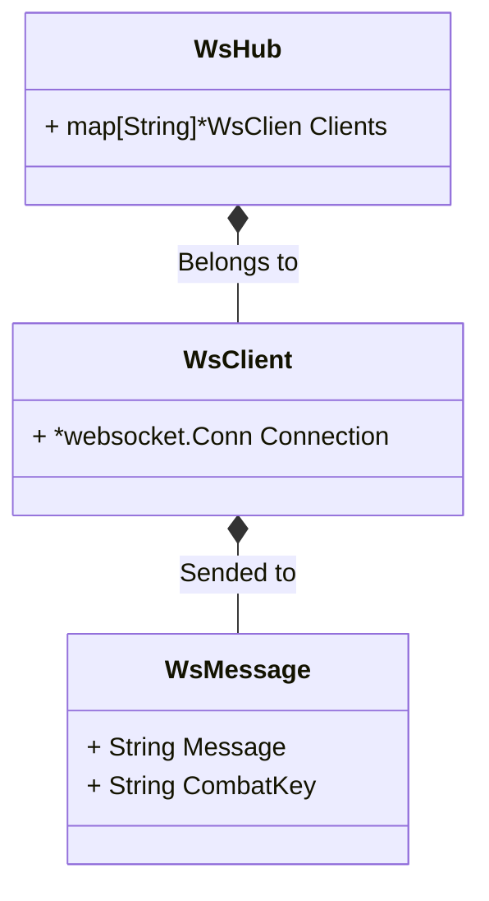

# WebSockets for combats

## Required structs

```mermaid
classDiagram
  WsHub *-- WsClient: Belongs to
  WsClient *-- WsMessage: Sended to

  class WsHub {
    + map[String]*WsClien Clients
  }

  class WsClient {
    + *websocket.Conn Connection
  }

  class WsMessage {
    + String Message
    + String CombatKey
  }
```
